# Darmok control flow model

Source of truth: `DarmokMojo.java` and its helpers (`GenFromExistingMojo`, `GenFromComparisonMojo`, `ClaudeRunner`, `GitRunner`, `MavenRunner`, `ProcessRunner`).

**The PlantUML text below IS the model.** No rendering required. PlantUML (not Mermaid) was chosen to keep a future Graphwalker migration cheap.

## Filename convention

Each sub-machine below owns one or more asciidoc files under this directory. Filename stem = sub-machine name; a qualifier is appended when multiple files share a sub-machine. The convention is the mapping — no lookup table.

Examples:

- `Branch Verification` sub-machine → `Branch Verification.asciidoc`
- `Commit Behavior` sub-machine → `Commit Behavior Clean Workspace.asciidoc`, `Commit Behavior Full Cycle.asciidoc`, `Commit Behavior Process Charts.asciidoc`

## Goals

| Goal | Difference |
|---|---|
| `darmok:gen-from-existing` | Plain loop over `scenarios-list.txt` |
| `darmok:gen-from-comparison` | Runs `claude /rgr-gen-from-comparison` once before each loop iteration; otherwise identical |

---

## Overview

Navigation diagram showing how the 10 leaf sub-machines connect on the happy path: init, cleanup, loop over scenarios, RGR per scenario, commit, next. Non-happy paths (aborts, retries, timeouts, verify failures) live in the leaf sub-machines below.

Overview is navigation-only. It has no dedicated asciidoc file — every transition in it delegates to a leaf sub-machine whose file(s) own the tests. The end-to-end happy path it depicts is exercised in aggregate by `Commit Behavior Full Cycle.asciidoc` (single scenario, stage flag variants) and `Scenario Loop Multiple Scenarios.asciidoc` (N > 1 scenarios). The N:1 filename-to-sub-machine rule applies to the 10 leaf sub-machines; Overview is exempt.

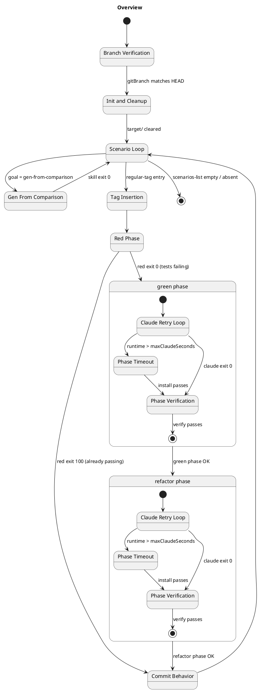

Every node is a sub-machine (by name). The two composite states `green phase` and `refactor phase` group the three sub-machines (`Claude Retry Loop`, `Phase Timeout`, `Phase Verification`) that run in sequence per phase. Lower-case `phase` is deliberate — those composites are not themselves sub-machines, they're just sequencing annotations over the three that are.

Guards on the happy path:

- `BranchVerification → InitAndCleanup` assumes the `gitBranch` param is set and equals `git rev-parse --abbrev-ref HEAD`.
- `RedPhase → CommitBehavior` (exit 100 branch) fires when src/main already implements the tag — both phases skipped; commit message `run-rgr red <scenario>`.
- `Refactor → CommitBehavior` commit shape depends on `stage`:
  - `stage=false` → three commits (`run-rgr red|green|refactor <scenario>`), interleaved with each phase's exit (not shown — see **Commit Behavior** below).
  - `stage=true` → one commit (`run-rgr <scenario>`) at the end.

---

## Branch Verification

`init()` resolves `baseDir`, opens the two log files, then validates the `gitBranch` parameter against the current HEAD before any subprocess is spawned. All failures emit an ERROR line to `darmok.mojo.<date>.log` and throw `MojoExecutionException` with a message that matches the log line verbatim.

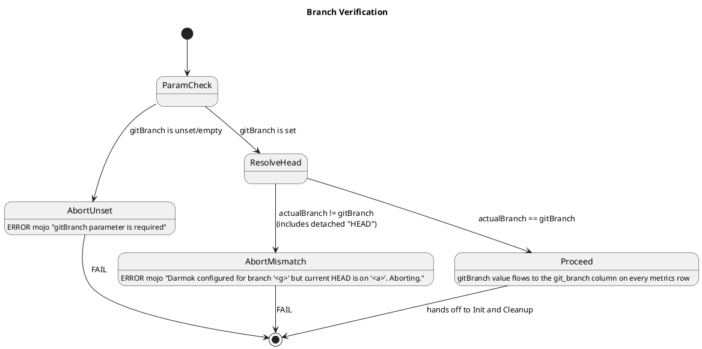

Notes:

- `AbortUnset` short-circuits before `git rev-parse`, so `darmok.runners.<date>.log` is empty.
- `AbortMismatch` runs `git rev-parse --abbrev-ref HEAD` once; runner log has exactly that DEBUG line.
- Detached HEAD collapses into `AbortMismatch` with `actualBranch="HEAD"`.

---

## Init and Cleanup

Runs on every successful branch-verification. Opens the two dated log files (`darmok.mojo.<date>.log`, `darmok.runners.<date>.log`), deletes stale NUL-files in the parent tree, then deletes and re-creates the `target/` directory.

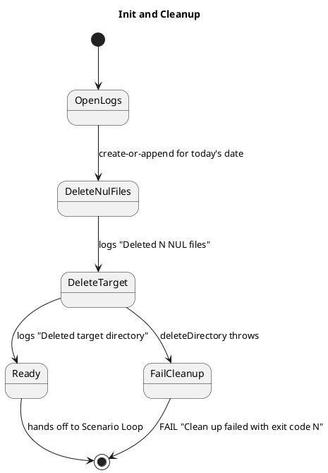

Invariant: by the time this sub-machine exits `Ready`, both log files are present and writable. They are the primary observable contract for every downstream state.

Same-day re-run: `OpenLogs` uses the date-stamped filename, so a second invocation on the same date appends to the existing log files rather than rotating. This is the observable captured by the `Init and Cleanup` asciidoc file (previously `Run RGR Multiple Runs Same Day`).

---

## Scenario Loop

Walks `scenarios-list.txt` one entry at a time, skipping `NoTag` rows silently, handing regular-tag rows off to `Tag Insertion`.

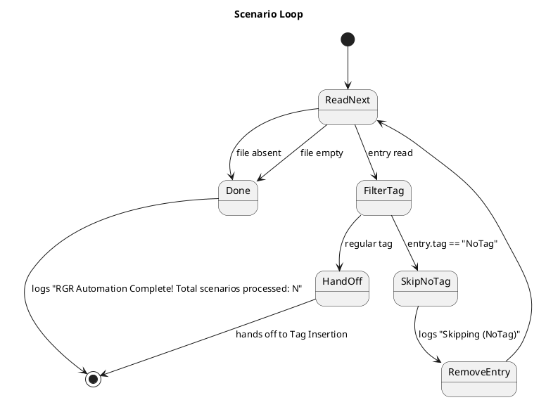

Files under this sub-machine:

- `Scenario Loop No Scenarios.asciidoc` — list absent · list empty · single `NoTag` entry.
- `Scenario Loop Multiple Scenarios.asciidoc` — N ≥ 2 entries, processed in file order.

---

## Tag Insertion

Applies only when the scenario has a regular tag. Four observable outcomes; all four flow into `Red Phase`.

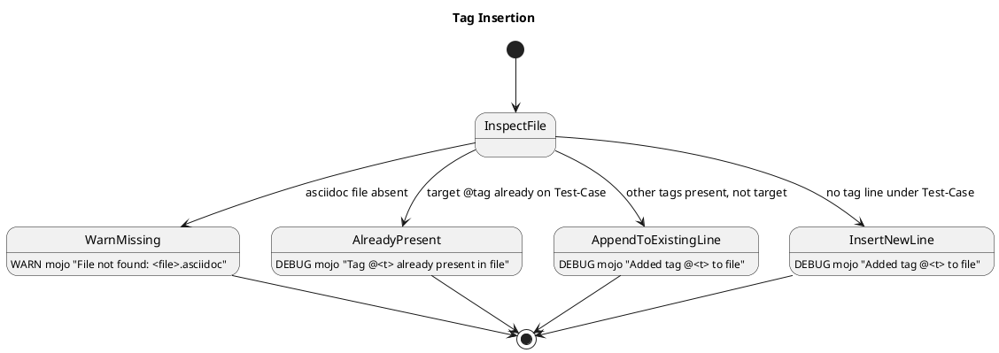

Files under this sub-machine:

- `Tag Insertion Missing File.asciidoc` — `WarnMissing` transition only.
- `Tag Insertion Tag Handling.asciidoc` — the three `Already / Append / Insert` transitions.

`WarnMissing` does not abort; the subsequent red-phase mvn call will fail naturally and drop into the `Claude Retry Loop` sub-machine.

---

## Red Phase

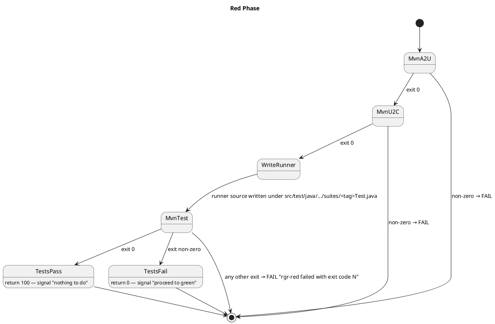

Files under this sub-machine:

- `Red Phase Already Passing.asciidoc` — `TestsPass` transition (exit 100, skip green+refactor).
- `Red Phase Maven Failures.asciidoc` — `MvnA2U` / `MvnU2C` / `WriteRunner` (compile) failure transitions.

Known gap: `WriteRunner` emits a `.java` file whose content is not asserted by any current Test-Case — the generated runner class could silently change and all tests would still pass. This is the trigger case for the parent issue.

---

## Claude Retry Loop

Wraps every claude invocation inside the green phase and the refactor phase. Phase-agnostic — the diagram below uses `<phase>` as a placeholder for either. The outer loop handles retryable Anthropic API errors (`API Error: 500`, `API Error: 529`, `Internal server error`, `overloaded`). Retries and timeouts are independent axes: retries consume `maxRetries`; timeouts consume `maxTimeoutAttempts`.

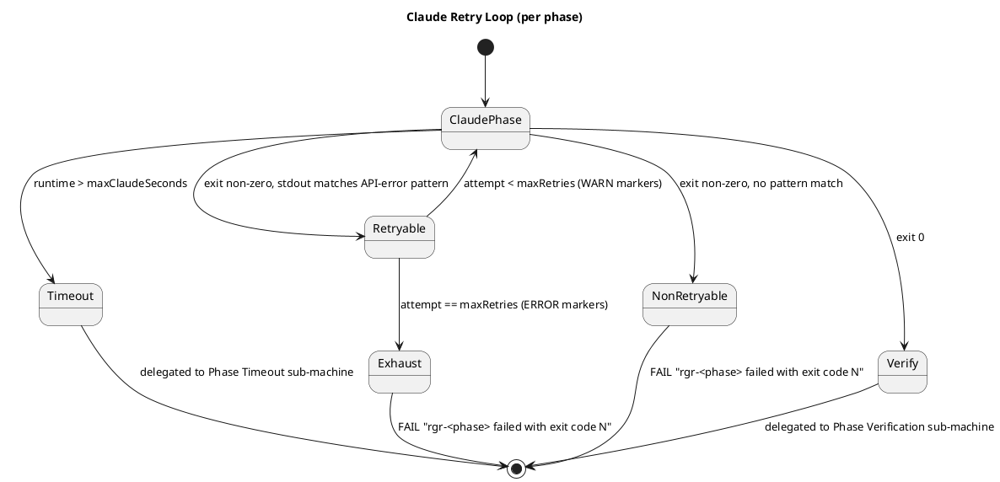

Files under this sub-machine:

- `Claude Retry Loop Non-Retryable.asciidoc` — `NonRetryable` transition (opaque exit codes, SIGKILL, SIGINT).
- `Claude Retry Loop Retryable.asciidoc` — `Retryable` + `Exhaust` transitions across all four patterns, both phases.
- `Claude Retry Loop Partial Output.asciidoc` — stdout mirroring observable on the `NonRetryable` transition: the runner log captures whatever claude printed before the failure marker.

Both `Timeout` and `Verify` re-enter this state machine via the sub-machines below; on their successful exits, control continues to the phase commit.

---

## Phase Timeout

`maxClaudeSeconds` bounds both the process-handle `waitFor` and the stdout reader's `join` — either hitting the bound drops into this sub-machine. Default 720s (UCL of per-scenario runtime on the SPC dashboard).

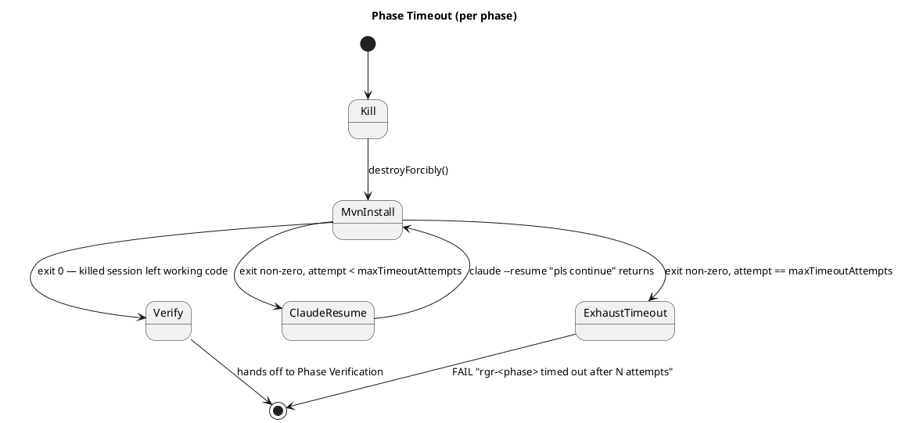

Files under this sub-machine:

- `Phase Timeout.asciidoc` — all timeout transitions, both phases, including the reader-half case (process exits but stdout pipe stays open).

Counting rule: on exhaustion, `mvn clean install` was invoked `maxTimeoutAttempts` times and `claude --resume` exactly `maxTimeoutAttempts - 1` times — no resume after the final failing install.

Reader-half: if the process handle exits but the stdout pipe stays open (Windows `claude.cmd` → grandchild `node`), the reader-side `join` trips the same `Kill` transition. Observably identical to a process-side timeout.

---

## Phase Verification

`mvn clean verify` runs after every successful claude call (including recovered timeouts). On failure, Darmok resumes the claude session with `"mvn clean verify failures should be fixed"` and re-runs verify. Bounded by `maxVerifyAttempts` (default 3). Verify happens before the phase commit, so a verify failure never produces a commit for that phase.

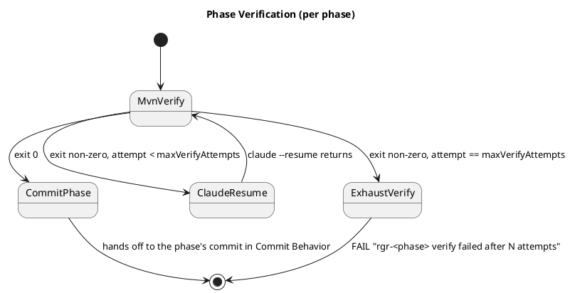

Files under this sub-machine:

- `Phase Verification.asciidoc` — all verify transitions, both phases.

Counting rule: on exhaustion, `mvn clean verify` was invoked `maxVerifyAttempts` times and `claude --resume` exactly `maxVerifyAttempts - 1` times.

---

## Commit Behavior

`commitIfChanged` runs `git diff --cached --quiet` before every commit; an empty stage produces no commit. The commit messages and counts depend on `stage` and on which phases executed.

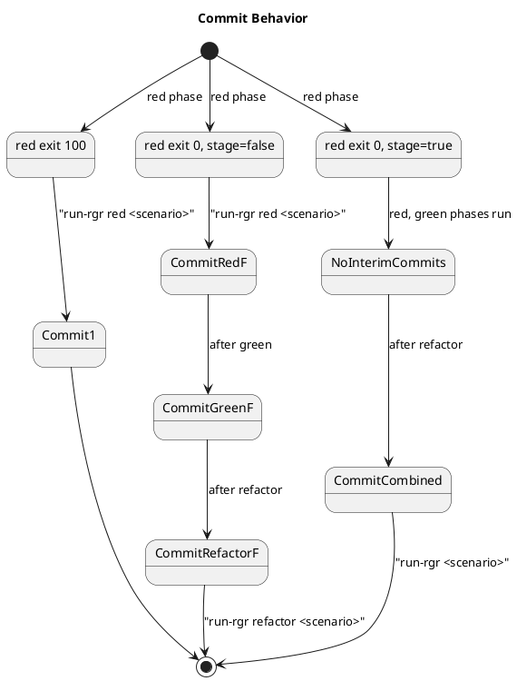

Files under this sub-machine:

- `Commit Behavior Clean Workspace.asciidoc` — `commitIfChanged` skip-on-empty-stage.
- `Commit Behavior Full Cycle.asciidoc` — per-phase vs combined commits (`stage` flag).
- `Commit Behavior Process Charts.asciidoc` — `metrics.csv` commit-SHA column on every row.

Phase-failure implications:

- Red pass + green fail — impossible (red pass short-circuits to commit).
- Red fail + green fail (non-retryable/exhausted/timeout/verify) — if `stage=false` the red commit stands; if `stage=true` nothing is committed for this scenario.
- Red fail + green OK + refactor fail — green commit stands under `stage=false`; nothing committed under `stage=true`.

`metrics.csv` row contract (one row per successful scenario, appended atomically):

| Column | Source | Notes |
|---|---|---|
| `Timestamp` | `init()` wallclock per scenario | |
| `GitBranch` | `gitBranch` parameter | Validated at init against `git rev-parse --abbrev-ref HEAD`. Stable across all rows of a run. |
| `Commit` | `git rev-parse HEAD` after `CommitCombined` / `CommitRefactorF` / `Commit1` | 40-char SHA of whichever commit this scenario produced last. |
| `Scenario` | scenario name from `scenarios-list.txt` | |
| `PhaseRedMs` | millis elapsed in `Red Phase` | |
| `PhaseGreenMs` | millis elapsed in `Claude Retry Loop` + `Phase Timeout` + `Phase Verification` for green | 0 when red exit 100 |
| `PhaseRefactorMs` | same three sub-machines, refactor side | 0 when red exit 100 |
| `PhaseTotalMs` | scenario wall-clock | |

---

## Gen From Comparison

Wraps the standard scenario iteration with one claude call per loop.

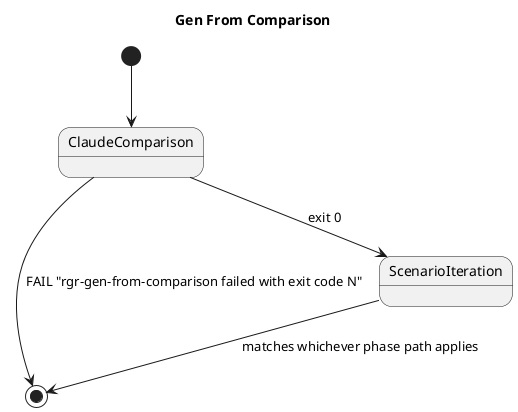

Files under this sub-machine:

- `Gen From Comparison.asciidoc` — skill-success (full cycle below follows) and skill-fail (abort before any `Processing Scenario:` line).

---

## Input dimensions

Parameters that change observable behavior:

| Dimension | Values |
|---|---|
| `gitBranch` param | unset · matches HEAD · mismatches HEAD · detached HEAD |
| `scenariosFile` state | absent · empty · N entries |
| `scenario.tag` | `NoTag` · regular |
| asciidoc file state | missing · target tag present · other tags present · no tag line |
| red outcome | exit 100 · exit 0 |
| green outcome | success · non-retryable fail · retryable-recover · retryable-exhaust |
| refactor outcome | success · fail (mirrors green axes) |
| `stage` | `true` (combined commit) · `false` (per-phase commits) |
| `pipeline` | `forward` · `reverse` (refactor prompt only) |
| `onlyChanges` | `true` · `false` (svc-plugin goals only) |
| `LOG_PATH` env | unset (`target/darmok/`) · set |
| `maxClaudeSeconds` | 720 (UCL default) · small N (test-compressed) |
| `maxTimeoutAttempts` | 2 (default) · N |
| `maxVerifyAttempts` | 3 (default) · N |
| `maxRetries` | default · N |
| per-attempt claude runtime | ≤ timeout · > timeout → kill |
| post-kill install outcome | exit 0 · exit non-zero |

---

## Observations

1. **Branch Verification, Init and Cleanup are invariants** — every run passes through them. Could become a shared `Test-Setup`.
2. **Tag Insertion and the phase sub-machines are orthogonal.** Full matrix would be 4 × 7 = 28; current shape is 4 tag specs × 1 default phase + 7 phase specs × 1 default tag = 11. The cross-product isn't worth the maintenance.
3. **`commitIfChanged` skip-on-empty-stage** (`git diff --cached --quiet`) is covered by `Commit Behavior Clean Workspace`.
4. **`pipeline` parameter** (`forward` / `reverse`) only changes the refactor prompt string; observable diff is limited to the `claude` runner log line.
5. **Metrics** — every successful scenario emits four `METRIC` log lines plus a `metrics.csv` row. Consumed by `pbc-report-plantuml`, so the format is part of the contract. See **Commit Behavior** for the row shape.
6. **`LOG_PATH` env var** — if set, logs land elsewhere. One spec covering "LOG_PATH set" is enough.
7. **No refactor-only path** — tree shape is `Red → (Green → Refactor)` or `Red alone`.
8. **Phase Verification is a sub-step, not a phase** — it lives inside green and inside refactor, after the Claude Retry Loop and Phase Timeout sub-machines have reached exit 0.
9. **Phase Timeout is also a sub-step** — order within each phase is: Claude Retry Loop → Phase Timeout (only fires if the claude call exceeded `maxClaudeSeconds`) → Phase Verification → phase commit. Timeouts are not API errors and don't consume `maxRetries`.
10. **`maxClaudeSeconds` source** — default 720 comes from the UCL of the per-scenario runtime distribution on the SPC dashboard. When grafana becomes queryable from the plugin (future issue), this property becomes the fallback for "grafana unavailable", not the default value.

---

## Notes

- Regenerate when `DarmokMojo` or its helpers gain a new branch point. The file is the model; the code is the ground truth.
