# Darmok control flow model

Migrated from `sheep-dog-svc/darmok-maven-plugin/tests.md` per [#292](https://github.com/farhan5248/sheep-dog-main/issues/292) (split from [#285](https://github.com/farhan5248/sheep-dog-main/issues/285)).

Source of truth: `DarmokMojo.java` and its helpers (`GenFromExistingMojo`, `GenFromComparisonMojo`, `ClaudeRunner`, `GitRunner`, `MavenRunner`, `ProcessRunner`).

**The PlantUML text below IS the model.** No rendering required — same posture as the ASCII art it replaces. PlantUML (not Mermaid) was chosen to keep a future Graphwalker migration cheap.

## Goals

| Goal | Difference |
|---|---|
| `darmok:gen-from-existing` | Plain loop over `scenarios-list.txt` |
| `darmok:gen-from-comparison` | Runs `claude /rgr-gen-from-comparison` once before each loop iteration; otherwise identical |

---

## Top-level state machine — happy path

Captures the successful end-to-end flow: init, cleanup, loop over scenarios, RGR per scenario, commit, next. Non-happy paths (aborts, retries, timeouts, verify failures) are deferred to per-phase sub-machines below.

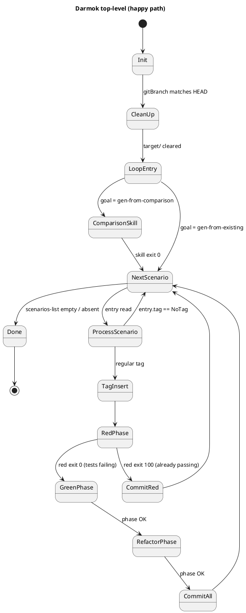

Guards on the happy path:

- `Init → CleanUp` assumes `gitBranch` param is set and equals `git rev-parse --abbrev-ref HEAD`.
- `RedPhase → CommitRed` fires on exit 100 (src/main already implements the tag) — green and refactor are skipped; commit message `run-rgr red <scenario>`.
- `RefactorPhase → CommitAll` fires on exit 0. Commit shape depends on `stage`:
  - `stage=false` → three commits (`run-rgr red|green|refactor <scenario>`), interleaved with the phase transitions (not shown in the top-level diagram — see **Commit behavior** below).
  - `stage=true` → one commit (`run-rgr <scenario>`) at the end.

---

## Sub-machine — Preamble: branch verification

`init()` resolves `baseDir`, opens the two log files, then validates the `gitBranch` parameter against the current HEAD before any subprocess is spawned. All failures emit an ERROR line to `darmok.mojo.<date>.log` and throw `MojoExecutionException` with a message that matches the log line verbatim.

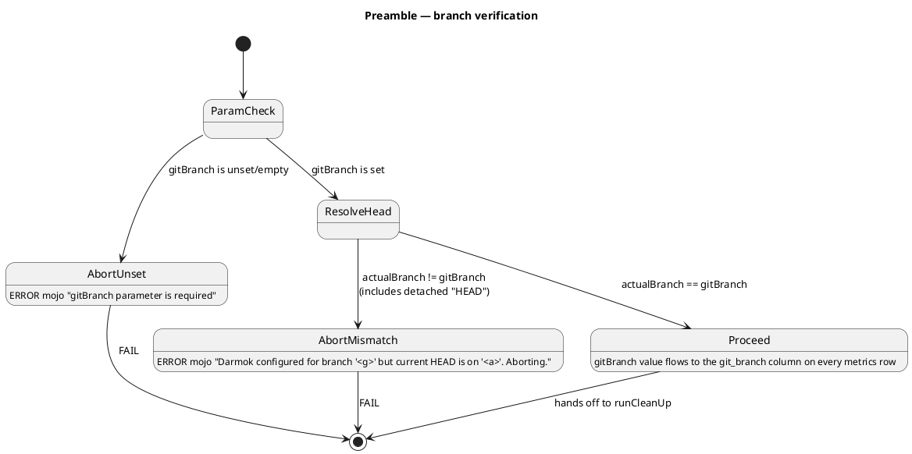

Notes:

- `AbortUnset` short-circuits before `git rev-parse`, so `darmok.runners.<date>.log` is **empty** for BV-1.
- `AbortMismatch` runs `git rev-parse --abbrev-ref HEAD` once; runner log has exactly that DEBUG line.
- Detached HEAD collapses into `AbortMismatch` with `actualBranch="HEAD"`.

---

## Sub-machine — Preamble: init + runCleanUp

Runs on every successful branch-verification. Deletes stale NUL-files in the parent tree and the `target/` directory, then re-creates `target/darmok/` for the two log files.

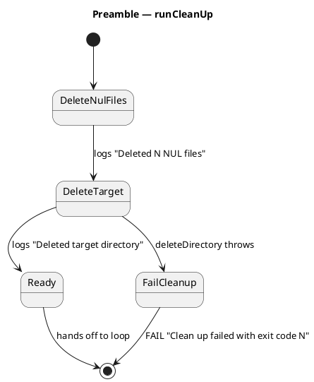

Invariant: by the time this sub-machine exits `Ready`, both `target/darmok/darmok.mojo.<date>.log` and `target/darmok/darmok.runners.<date>.log` are present (opened by `init()`). These two files are the primary observable contract for every downstream state.

---

## Sub-machine — Loop entry + scenario filter

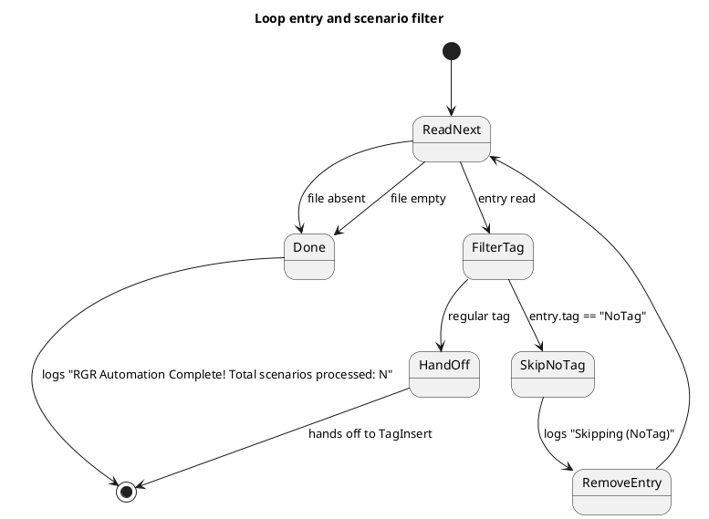

NoTag rows are consumed silently (entry removed, no commit, no phase logs).

---

## Sub-machine — Tag insertion

Applies only when the scenario has a regular tag. Four observable outcomes, flows into RedPhase in all four.

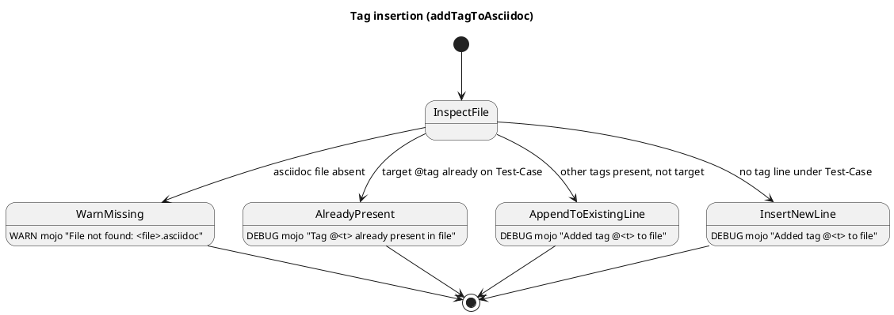

All four exits hand off to RedPhase. `WarnMissing` does not abort; the red-phase mvn call will fail naturally and drop into the GreenPhase sub-machine.

---

## Sub-machine — Red phase

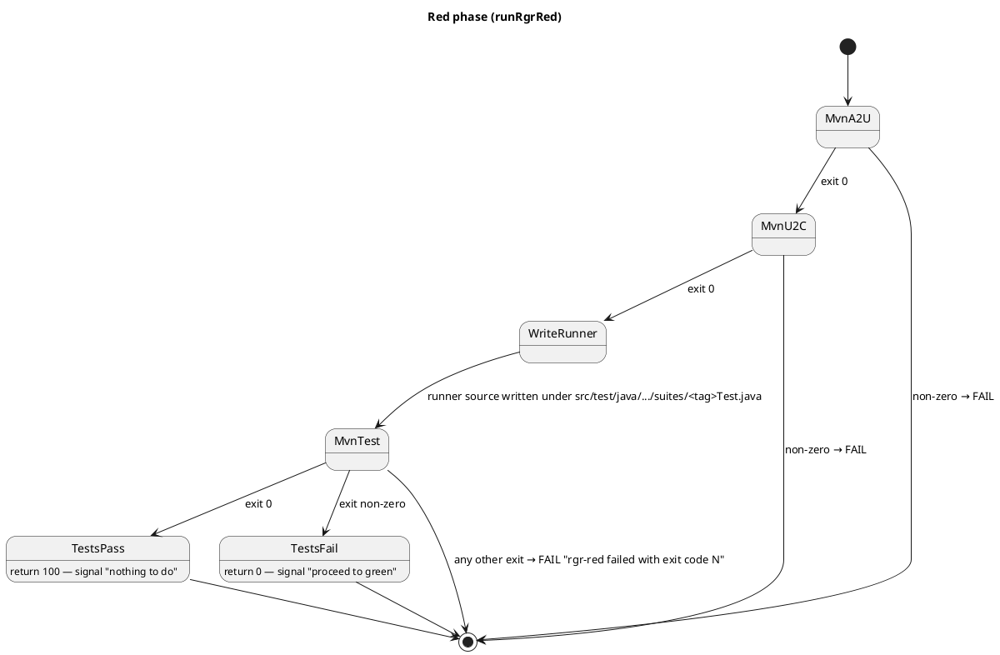

Known gap (#285, part F): `WriteRunner` emits a `.java` file whose content is never asserted by any current Test-Case. That's the `RedPhase.generateRunnerClassContent` case the parent issue exists to fix.

---

## Sub-machine — Green phase (outer, retry loop)

The outer loop handles retryable Anthropic API errors (500 / 529 / `Internal server error` / `overloaded`). Retries and timeouts are independent axes: retries consume `maxRetries`, timeouts consume `maxTimeoutAttempts`.

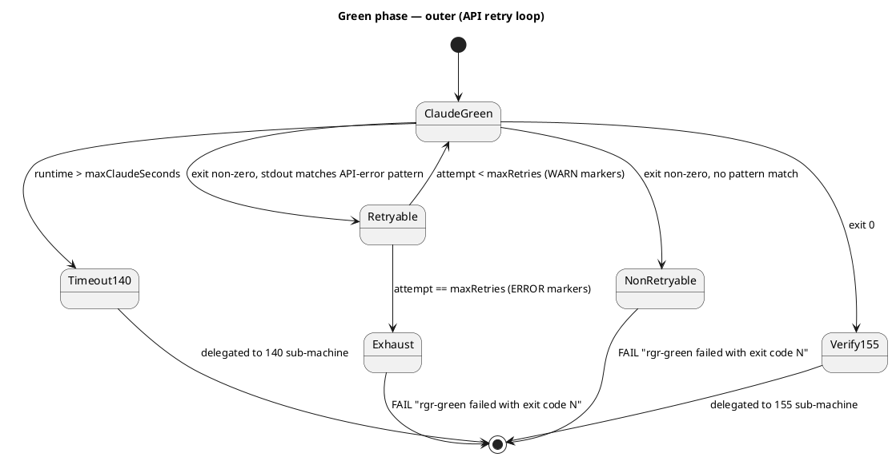

Both `Timeout140` and `Verify155` re-enter this state machine via the 140 and 155 sub-machines below; on their successful exits, control continues to the green commit.

---

## Sub-machine — Green phase 140 (timeout + install-check recovery)

`maxClaudeSeconds` bounds both the process-handle `waitFor` and the stdout reader's `join` — either hitting the bound drops into this sub-machine. Budget default: 720s (UCL of per-scenario runtime on the SPC dashboard).

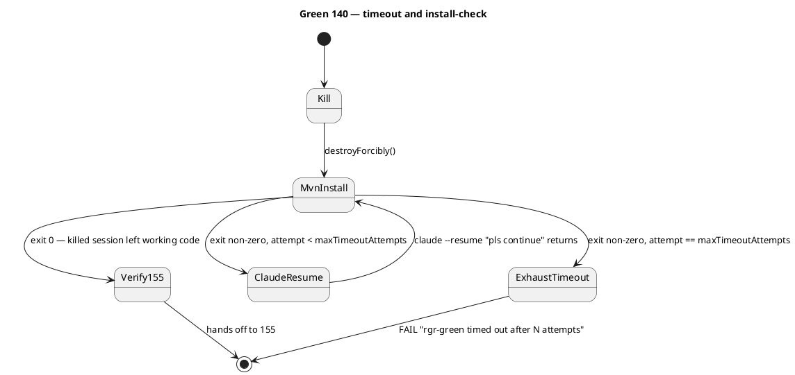

Counting rule (Path 27): on exhaustion, `mvn clean install` was invoked `maxTimeoutAttempts` times and `claude --resume` exactly `maxTimeoutAttempts - 1` times — no resume after the final failing install.

Reader half (Path 31): if the process handle exits but the stdout pipe stays open (Windows `claude.cmd` → grandchild `node`), the reader-side `join` trips the same `Kill` transition. Observably identical to a process-side timeout.

---

## Sub-machine — Green phase 155 (verify + claude --resume)

`mvn clean verify` runs after every successful green claude call (including recovered timeouts). On failure, Darmok resumes the claude session with `"mvn clean verify failures should be fixed"` and re-runs verify. Bounded by `maxVerifyAttempts` (default 3). Verify happens before the green commit, so a verify failure never produces a green commit.

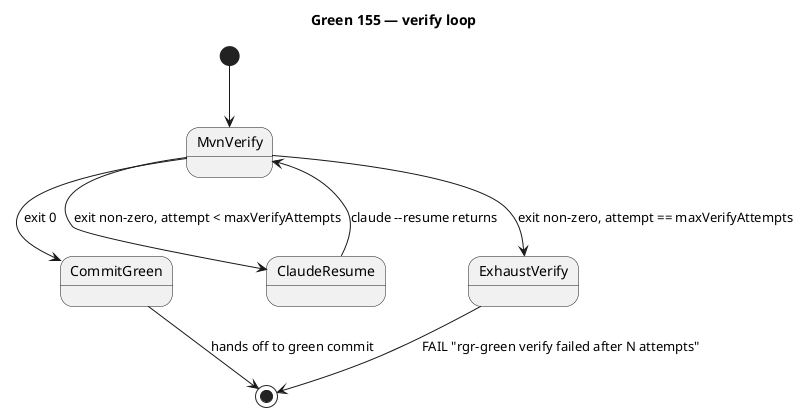

Counting rule (Path 20): on exhaustion, `mvn clean verify` was invoked `maxVerifyAttempts` times and `claude --resume` exactly `maxVerifyAttempts - 1` times.

---

## Sub-machine — Refactor phase

Structurally identical to green. Substitute:

- Outer: `ClaudeGreen` → `ClaudeRefactor` (skill `/rgr-refactor <pipeline> <artifactId>`; `pipeline` default `forward`).
- 140 timeout: same shape, resume prompt unchanged (`"pls continue"`).
- 155 verify: same shape, resume prompt unchanged (`"mvn clean verify failures should be fixed"`).
- FAIL messages swap `rgr-green` → `rgr-refactor` and `Green:` → `Refactor:` in all mojo log lines.

No separate diagram — the green diagrams above are the source; refactor is a textual rename.

There is no "refactor-only" path: refactor is only reached after green. The tree shape is `Red → (Green → Refactor)` or `Red alone`.

---

## Sub-machine — Commit behavior

`commitIfChanged` runs `git diff --cached --quiet` before every commit; an empty stage produces no commit (observable gap in current tests). The commit messages and counts depend on `stage` and on which phases executed.

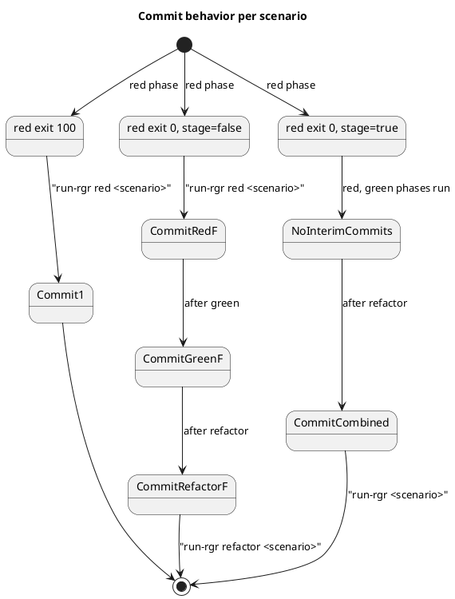

If a phase fails:

- Red pass + green fail impossible (red pass short-circuits to commit).
- Red fail + green fail (non-retryable/exhausted/timeout/verify) — if `stage=false` the red commit stands; if `stage=true` nothing is committed for this scenario.
- Red fail + green OK + refactor fail — green commit stands under `stage=false`; nothing committed under `stage=true`.

---

## Sub-machine — gen-from-comparison pre-step

Wraps the standard scenario iteration with one claude call per loop.

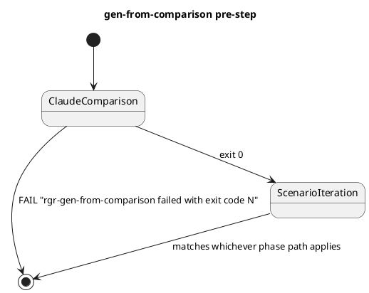

A comparison failure aborts before any `Processing Scenario:` / phase lines hit the log.

---

## State → old-path-ID → asciidoc Test-Case mapping

Anchors each state transition to the `tests.md` path ID it replaced and to the existing asciidoc Test-Case that covers it (if any). Empty **Test-Case** cells are known gaps and feed the #285 audit.

| State / transition | Old path | Test-Case |
|---|---|---|
| Preamble → AbortUnset | BV-1 | *Run RGR With Branch Verification* |
| Preamble → AbortMismatch | BV-2, BV-3 | *Run RGR With Branch Verification* |
| Preamble → Proceed | BV-4 | *Run RGR Full Cycle* |
| CleanUp fresh checkout | 0a | *Run RGR With Clean Workspace* |
| CleanUp prior artifacts | 0b | *Run RGR With Clean Workspace* |
| CleanUp fail | 17 | *(gap — exception branch)* |
| Loop entry — list absent | 1 | *Run RGR With No Scenarios* |
| Loop entry — list empty | 2 | *Run RGR With No Scenarios* |
| Scenario filter — NoTag | 3 | *Run RGR With Tag Handling* |
| TagInsert — file absent | 4 | *Run RGR With Missing Asciidoc File* |
| TagInsert — already present | 5 | *Run RGR With Tag Handling* |
| TagInsert — append to existing line | 6 | *Run RGR With Tag Handling* |
| TagInsert — insert new line | 7 | *Run RGR With Tag Handling* |
| Red → CommitRed (exit 100) | 8 | *Run RGR With Already Passing Tests* |
| Red → Green (exit 0), stage=false | 9 | *Run RGR Full Cycle* |
| Red → Green (exit 0), stage=true | 10 | *Run RGR Full Cycle* |
| Green NonRetryable | 11 | *Run RGR With Claude Failure* |
| Green Retryable recovers | 12 | *Run RGR With Claude Retries* |
| Green Exhaust | 13 | *Run RGR With Claude Retries* |
| Refactor NonRetryable | 14 | *Run RGR With Claude Failure* |
| Comparison skill OK | 15 | *Run Gen From Comparison* |
| Comparison skill fail | 16 | *Run Gen From Comparison* |
| 155 — verify passes | 18 | *Run RGR With Phase Verification* |
| 155 — verify resume recovers (green) | 19 | *Run RGR With Phase Verification* |
| 155 — verify exhaust (green) | 20 | *Run RGR With Phase Verification* |
| 155 — verify passes (refactor) | 21 | *Run RGR With Phase Verification* |
| 155 — verify resume recovers (refactor) | 22 | *Run RGR With Phase Verification* |
| 155 — verify exhaust (refactor) | 23 | *Run RGR With Phase Verification* |
| 140 — claude in budget (green) | 24 | *Run RGR With Phase Timeout* |
| 140 — killed + install passes (green) | 25 | *Run RGR With Phase Timeout* |
| 140 — killed + resume recovers (green) | 26 | *Run RGR With Phase Timeout* |
| 140 — timeout exhaust (green) | 27 | *Run RGR With Phase Timeout* |
| 140 — claude in budget (refactor) | 28 | *Run RGR With Phase Timeout* |
| 140 — killed + resume recovers (refactor) | 29 | *Run RGR With Phase Timeout* |
| 140 — timeout exhaust (refactor) | 30 | *Run RGR With Phase Timeout* |
| 140 — reader-half timeout | 31 | *Run RGR With Phase Timeout* |
| `WriteRunner` output content | (new, #285 F) | *(gap — no Test-Case asserts generated runner)* |
| `commitIfChanged` skip-on-empty-stage | (new, observation 3) | *(gap)* |

---

## Input dimensions (unchanged from tests.md)

| Dimension | Values |
|---|---|
| `gitBranch` param | unset · matches HEAD · mismatches HEAD · detached HEAD |
| `scenariosFile` state | absent · empty · N entries |
| `scenario.tag` | `NoTag` · regular |
| asciidoc file state | missing · target tag present · other tags present · no tag line |
| red outcome | exit 100 · exit 0 |
| green outcome | success · non-retryable fail · retryable-recover · retryable-exhaust |
| refactor outcome | success · fail (mirrors green axes) |
| `stage` | `true` (combined commit) · `false` (per-phase commits) |
| `pipeline` | `forward` · `reverse` (refactor prompt only) |
| `onlyChanges` | `true` · `false` (svc-plugin goals only) |
| `LOG_PATH` env | unset (`target/darmok/`) · set |
| `maxClaudeSeconds` | 720 (UCL default) · small N (test-compressed) |
| `maxTimeoutAttempts` | 2 (default) · N |
| `maxVerifyAttempts` | 3 (default) · N |
| `maxRetries` | default · N |
| per-attempt claude runtime | ≤ timeout · > timeout → kill |
| post-kill install outcome | exit 0 · exit non-zero |

---

## Observations

1. **Branch-verification + init + runCleanUp are invariants** — every run passes through them. Could become a shared `Test-Setup`.
2. **Paths 4–7 (tag variations) are orthogonal to Paths 8–14 (phase outcomes)**. Full matrix would be 4 × 7 = 28; the current shape is 4 tag specs × 1 default phase + 7 phase specs × 1 default tag = 11. The cross-product isn't worth the maintenance.
3. **`commitIfChanged` skip-on-empty-stage** (`git diff --cached --quiet`) is a nuance not covered by any current Test-Case.
4. **`pipeline` parameter** (`forward` / `reverse`) only changes the refactor prompt string; observable diff is limited to the `claude` runner log line.
5. **Metrics** — every successful scenario emits four `METRIC` lines (red-maven / green / refactor / total). Consumed by `pbc-report-plantuml`, so the format is part of the contract.
   - **`git_branch` column** — `metrics.csv` gains a stable `git_branch` column populated from the `gitBranch` param (validated at init). The SPC dashboard joins on it.
6. **`LOG_PATH` env var** — if set, logs land elsewhere. One spec covering "LOG_PATH set" is enough.
7. **No refactor-only path** — tree shape is `Red → (Green → Refactor)` or `Red alone`.
8. **Verify is a sub-step, not a phase** — 155 lives inside green and inside refactor, not beside them. Phase paths that succeed (9, 10, 12, 26) transitively include the Path 18 verify assertions.
9. **Timeout is a sub-step, also inside each phase** — 140 order: claude (bounded by `maxClaudeSeconds`) → timeout-recovery loop → 155 verify loop → commit. Timeouts are not API errors and don't consume `maxRetries`.
10. **`maxClaudeSeconds` source** — default 720 comes from the UCL of the per-scenario runtime distribution on the SPC dashboard. When grafana becomes queryable from the plugin (future issue), this property becomes the fallback for "grafana unavailable", not the default value.
11. **RedPhase.generateRunnerClassContent** — the runner `.java` produced by `WriteRunner` is written to disk but never read back by any current Test-Case. This is the known gap that spawned [#285](https://github.com/farhan5248/sheep-dog-main/issues/285).

---

## Notes

- Anchors (`BV-1`, `Path 5`, etc.) are retained for traceability during the migration; once all audit follow-ups from #285 have landed they can be dropped in favour of state names.
- Regenerate when `DarmokMojo` or its helpers gain a new branch point. The file is the model; the code is the ground truth.
- Parent issues: [#292](https://github.com/farhan5248/sheep-dog-main/issues/292), [#285](https://github.com/farhan5248/sheep-dog-main/issues/285).
