# Darmok control flow model

Source of truth: `DarmokMojo.java` and its helpers (`GenFromExistingMojo`, `GenFromComparisonMojo`, `ClaudeRunner`, `GitRunner`, `MavenRunner`, `ProcessRunner`).

**The PlantUML text below IS the model.** No rendering required. PlantUML (not Mermaid) was chosen to keep a future Graphwalker migration cheap.

## Filename convention

Each sub-machine below owns one or more asciidoc files under this directory. Filename stem = sub-machine name; a qualifier is appended when multiple files share a sub-machine. The convention is the mapping — no lookup table.

Examples:

- `Branch Verification` sub-machine → `Branch Verification.asciidoc`
- `Commit Behavior` sub-machine → `Commit Behavior Clean Workspace.asciidoc`, `Commit Behavior Full Cycle.asciidoc`, `Commit Behavior Process Charts.asciidoc`

## Goals

| Goal | Difference |
|---|---|
| `darmok:gen-from-existing` | Plain loop over `scenarios-list.txt` |
| `darmok:gen-from-comparison` | Runs `claude /rgr-gen-from-comparison` once before each loop iteration; otherwise identical |

---

## Overview

Navigation diagram showing how the 10 leaf sub-machines connect on the happy path: init, cleanup, loop over scenarios, RGR per scenario, commit, next. Non-happy paths (aborts, retries, timeouts, verify failures) live in the leaf sub-machines below.

Overview is navigation-only. It has no dedicated asciidoc file — every transition in it delegates to a leaf sub-machine whose file(s) own the tests. The end-to-end happy path it depicts is exercised in aggregate by `Commit Behavior Full Cycle.asciidoc` (single scenario, stage flag variants) and `Scenario Loop Multiple Scenarios.asciidoc` (N > 1 scenarios). The N:1 filename-to-sub-machine rule applies to the 10 leaf sub-machines; Overview is exempt.

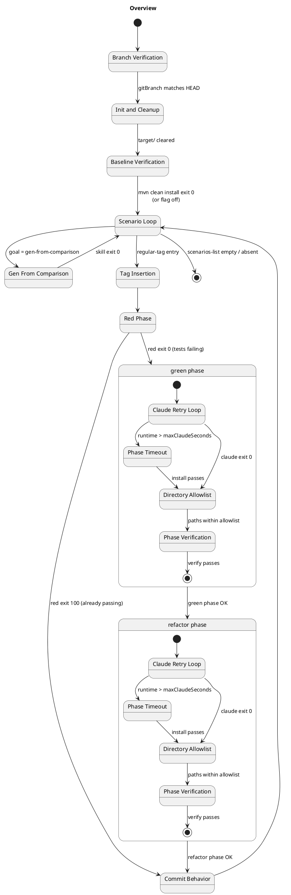

Every node is a sub-machine (by name). The two composite states `green phase` and `refactor phase` group the three sub-machines (`Claude Retry Loop`, `Phase Timeout`, `Phase Verification`) that run in sequence per phase. Lower-case `phase` is deliberate — those composites are not themselves sub-machines, they're just sequencing annotations over the three that are.

Guards on the happy path:

- `BranchVerification → InitAndCleanup` assumes the `gitBranch` param is set and equals `git rev-parse --abbrev-ref HEAD`.
- `RedPhase → CommitBehavior` (exit 100 branch) fires when src/main already implements the tag — both phases skipped; commit message `run-rgr red <scenario>`.
- `Refactor → CommitBehavior` commit shape depends on `stage`:
  - `stage=false` → three commits (`run-rgr red|green|refactor <scenario>`), interleaved with each phase's exit (not shown — see **Commit Behavior** below).
  - `stage=true` → red commits `"run-rgr <scenario>"` before green starts; green skips its commit; refactor `git commit --amend --no-edit` folds its delta into red's commit. Net observable: one commit per scenario (unchanged); the shift is that red output is committed up-front so downstream gates (allowlist, verify) see only the current phase's delta.

---

## Branch Verification

`init()` resolves `baseDir`, opens the two log files, then validates the `gitBranch` parameter against the current HEAD before any subprocess is spawned. All failures emit an ERROR line to `darmok.mojo.<date>.log` and throw `MojoExecutionException` with a message that matches the log line verbatim.

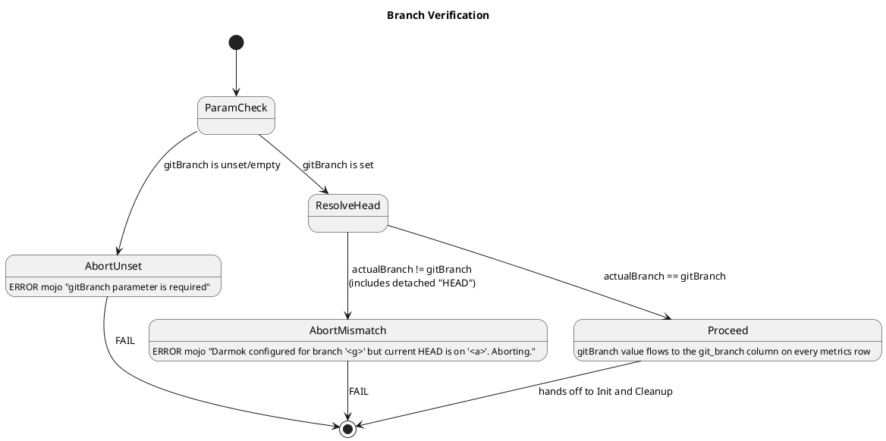

Notes:

- `AbortUnset` short-circuits before `git rev-parse`, so `darmok.runners.<date>.log` is empty.
- `AbortMismatch` runs `git rev-parse --abbrev-ref HEAD` once; runner log has exactly that DEBUG line.
- Detached HEAD collapses into `AbortMismatch` with `actualBranch="HEAD"`.

---

## Init and Cleanup

Runs on every successful branch-verification. Opens the two dated log files (`darmok.mojo.<date>.log`, `darmok.runners.<date>.log`), deletes stale NUL-files in the parent tree, then deletes and re-creates the `target/` directory.

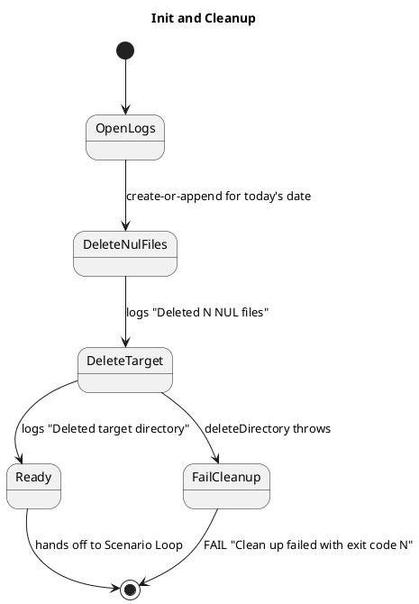

Invariant: by the time this sub-machine exits `Ready`, both log files are present and writable. They are the primary observable contract for every downstream state.

Same-day re-run: `OpenLogs` uses the date-stamped filename, so a second invocation on the same date appends to the existing log files rather than rotating. This is the observable captured by the `Init and Cleanup` asciidoc file (previously `Run RGR Multiple Runs Same Day`).

---

## Baseline Verification

Runs after `Init and Cleanup` (so `target/` has been cleared) and before the scenario loop reads `scenarios-list.txt`. Invokes `mvn clean install` in the target project's `baseDir` to confirm the working state is green before any scenario commits land on top of it. A non-zero exit emits an ERROR line to `darmok.mojo.<date>.log` and throws `MojoExecutionException`; `metrics.csv` is never opened, matching the Branch Verification abort invariant.

Gated by the `baselineVerifyEnabled` maven parameter, on by default (issue #312 introduced the flag default-off; #320 flipped the default).

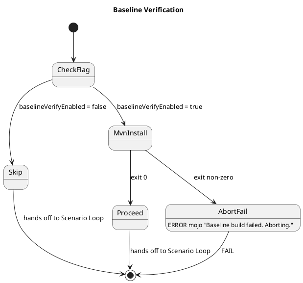

Notes:

- `Skip` is observable-empty: no mvn subprocess fires, no runner-log entry, no mojo-log entry. Reached only when a spec explicitly sets the flag off.
- `Proceed` runs exactly one `mvn clean install` subprocess — runner log captures the DEBUG invocation line; mojo log is silent on success.
- `AbortFail` fires before any scenario is read, so `scenarios-list.txt` state is irrelevant and `metrics.csv` stays absent.

Files under this sub-machine:

- `Baseline Verification.asciidoc` — both flag-on transitions (`Proceed`, `AbortFail`).

---

## Scenario Loop

Walks `scenarios-list.txt` one entry at a time, skipping `NoTag` rows silently, handing regular-tag rows off to `Tag Insertion`.

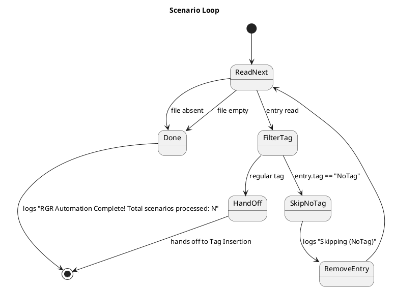

Files under this sub-machine:

- `Scenario Loop No Scenarios.asciidoc` — list absent · list empty · single `NoTag` entry.
- `Scenario Loop Multiple Scenarios.asciidoc` — N ≥ 2 entries, processed in file order.

---

## Tag Insertion

Applies only when the scenario has a regular tag. Four observable outcomes; all four flow into `Red Phase`.

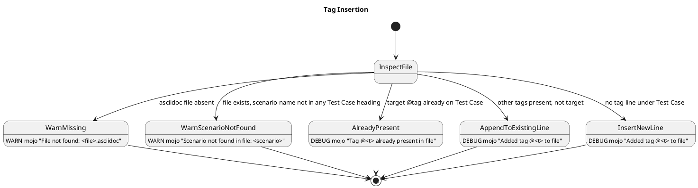

Files under this sub-machine:

- `Tag Insertion Missing File.asciidoc` — `WarnMissing` transition only.
- `Tag Insertion Scenario Not Found.asciidoc` — `WarnScenarioNotFound` transition only (issue 300).
- `Tag Insertion Tag Handling.asciidoc` — the three `Already / Append / Insert` transitions; `InsertNewLine` exercised twice (content-follows vs heading-at-EOF) so `insertTagAtTestCase`'s blank-line-skip and end-of-file branches both run (issue 300).

`WarnMissing` does not abort; the subsequent red-phase mvn call will fail naturally because its input file is missing. `WarnScenarioNotFound` also does not abort, but the red-phase mvn call still succeeds (the file is valid asciidoc) — `mvn test` then runs zero scenarios because no Test-Case carries the target tag, exits 0, and the red-exit-100 path fires.

---

## Red Phase

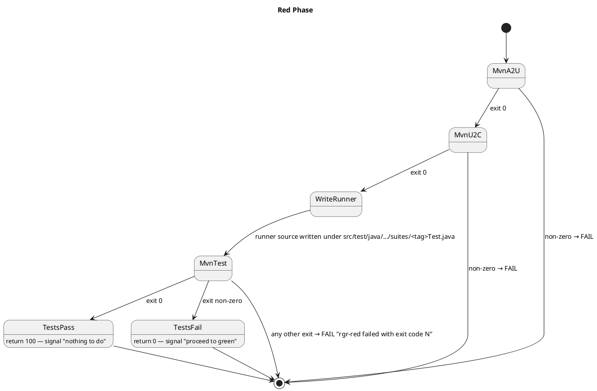

`MvnTest` tees its stdout to `${baseDir}/log.txt` (issue 325) — the file is overwritten on every invocation. This is the raw mvn output the green-phase claude prompt reads to diagnose the failure; the wrapped DEBUG line in `darmok.runners.<date>.log` carries the same content but with timestamp/level/category prefixes that aren't useful as prompt input.

Files under this sub-machine:

- `Red Phase Already Passing.asciidoc` — `TestsPass` transition (exit 100, skip green+refactor); also asserts `WriteRunner` content (issue 297).
- `Red Phase Maven Failures.asciidoc` — `MvnA2U` / `MvnU2C` / `WriteRunner` (compile) failure transitions.
- `Mvn Output Log Red Phase.asciidoc` — `MvnTest` writes mvn test output to `${baseDir}/log.txt`. Uses the red-exit-100 setup so red is the only mvn invocation in the run; the file's presence after the run proves Red Phase called `runToFile`.

---

## Claude Retry Loop

Wraps every claude invocation inside the green phase and the refactor phase. Phase-agnostic — the diagram below uses `<phase>` as a placeholder for either. The outer loop handles retryable Anthropic API errors (`API Error: 500`, `API Error: 529`, `Internal server error`, `overloaded`). Retries and timeouts are independent axes: retries consume `maxRetries`; timeouts consume `maxTimeoutAttempts`.

Session ID (issue #311): before the first call of the phase, Darmok generates a fresh UUID and passes it on the initial `claude --print` invocation as `--session-id <uuid>`. The UUID is captured on the per-phase `ClaudeRunner` instance (green and refactor each have their own) and reused by every `--resume` in the downstream sub-machines (Phase Timeout, Directory Allowlist, Phase Verification) as `claude --resume <uuid> <message>`. The Claude CLI requires a valid session ID when `--resume` is combined with `--print`; without the pre-generated ID, every resume call rejects in ~1.5s and burns a recovery attempt. Retried initial calls (the `Retryable --> ClaudePhase` loop edge) re-send the same UUID — session creation is idempotent on the CLI side.

Refactor-phase session handling is further parameterized by `refactorSessionMode` (issue #287) — in `continue` mode the refactor `ClaudeRunner` reuses green's UUID instead of generating a fresh one, and a `/compact` resume fires before refactor's first timed call. See **Refactor Session Mode** below.

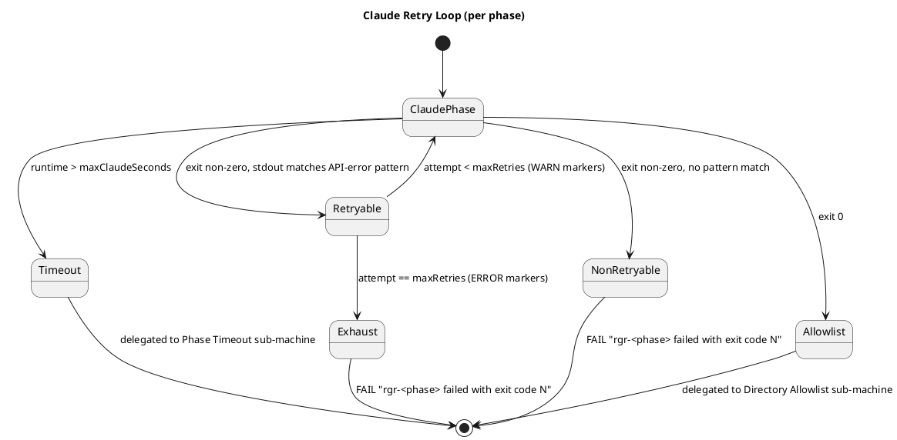

Files under this sub-machine:

- `Claude Retry Loop Non-Retryable.asciidoc` — `NonRetryable` transition (opaque exit codes, SIGKILL, SIGINT).
- `Claude Retry Loop Retryable.asciidoc` — `Retryable` + `Exhaust` transitions across all four patterns, both phases.
- `Claude Retry Loop Partial Output.asciidoc` — stdout mirroring observable on the `NonRetryable` transition: the runner log captures whatever claude printed before the failure marker.

`Timeout`, `Allowlist`, and (transitively) `Phase Verification` re-enter this state machine via the sub-machines below; on their successful exits, control continues to the phase commit.

---

## Phase Timeout

`maxClaudeSeconds` bounds both the process-handle `waitFor` and the stdout reader's `join` — either hitting the bound drops into this sub-machine. Default 720s (UCL of per-scenario runtime on the SPC dashboard).

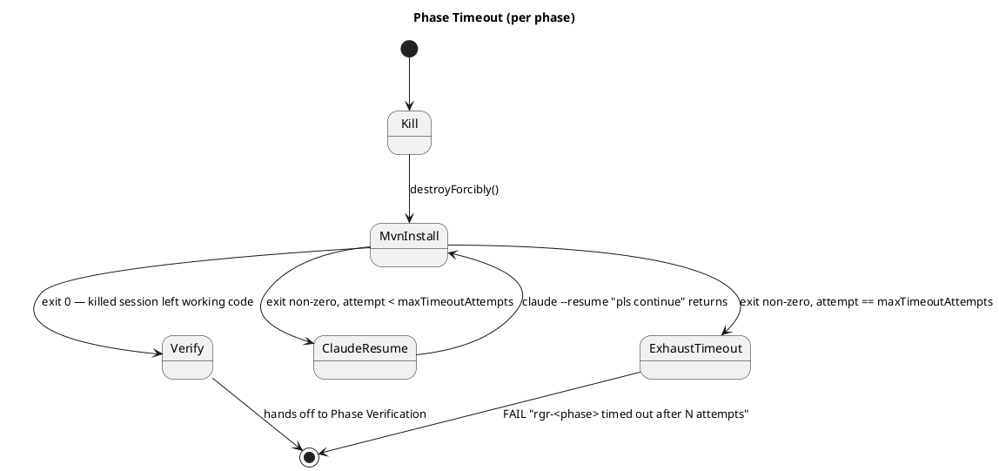

Files under this sub-machine:

- `Phase Timeout.asciidoc` — all timeout transitions, both phases, including the reader-half case (process exits but stdout pipe stays open).

Counting rule: on exhaustion, `mvn clean install` was invoked `maxTimeoutAttempts` times and `claude --resume` exactly `maxTimeoutAttempts - 1` times — no resume after the final failing install.

Resume call (issue #311): `claude --resume <session-id> "pls continue"`, where `<session-id>` is the UUID captured on this phase's initial call in `Claude Retry Loop`.

Reader-half: if the process handle exits but the stdout pipe stays open (Windows `claude.cmd` → grandchild `node`), the reader-side `join` trips the same `Kill` transition. Observably identical to a process-side timeout.

---

## Directory Allowlist

After every successful claude call (including the recovered-timeout path) darmok inspects the working tree against a directory allowlist before handing off to `mvn clean verify`. The effective allowlist is the union of two CSV mojo params (issue #314): `allowlistBasePaths` (default `src/main/java/,src/test/java/org/farhan/impl/` — the legacy hardcoded list, rarely overridden, only to *tighten*) and `allowlistAdditionalPaths` (default empty — the param projects use to *add* exceptions on top of the base, e.g. `src/test/resources/mojo-defaults.properties` for the case that originally surfaced #314 on #311). Anything that doesn't match — including red-phase-generated runner classes under `src/test/java/org/farhan/suites/` — is a contract violation, see issue #141. On violation darmok reverts the offending paths with `git checkout HEAD -- <paths>` and resumes the same claude session with a literal correction message, bounded by `maxAllowlistAttempts` (default 2). A working tree whose changes all fall inside the effective allowlist hands off to Phase Verification.

The allowlist gate runs before scenarios-list.txt is modified — see **Commit Behavior** for the reorder. Phase commits never include scenarios-list deltas; the file is the next-iteration cursor and lives in the post-refactor commit only.

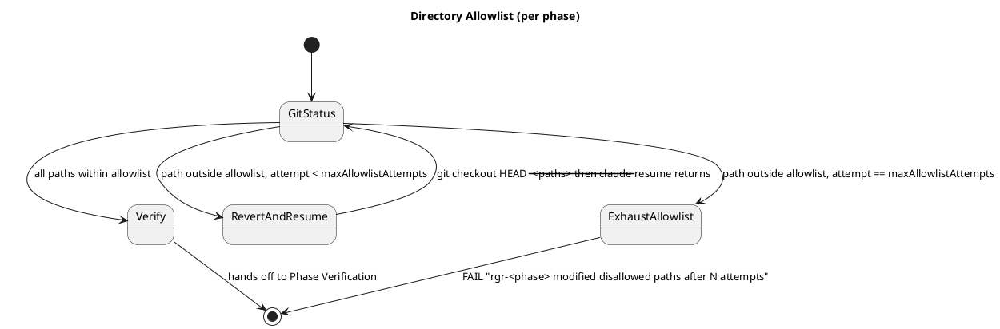

Files under this sub-machine:

- `Directory Allowlist.asciidoc` — all allowlist transitions, both phases.

Counting rule: on exhaustion, `git status --porcelain` was inspected `maxAllowlistAttempts` times and `claude --resume` exactly `maxAllowlistAttempts - 1` times — no resume after the final failing inspection. Mirrors Phase Timeout and Phase Verification.

Default `allowlistBasePaths` (per issue #141):

- `src/main/java/`
- `src/test/java/org/farhan/impl/`

Resume message: literal string `"only modify files under src/main/java or src/test/java/org/farhan/impl"` — exact wording is part of the observable contract. The message stays static even when `allowlistAdditionalPaths` extends the effective list; per-project guidance for the extra paths belongs in the project's CLAUDE.md, not in the resume prompt.

Resume call (issue #311): `claude --resume <session-id> "only modify files under src/main/java or src/test/java/org/farhan/impl"`, where `<session-id>` is the UUID captured on this phase's initial call in `Claude Retry Loop`.

---

## Phase Verification

`mvn clean verify` runs after every successful Directory Allowlist check (which itself runs after every successful claude call, including recovered timeouts). On failure, Darmok resumes the claude session with `"mvn clean verify failures should be fixed"` and re-runs verify. Bounded by `maxVerifyAttempts` (default 3). Verify happens before the phase commit, so a verify failure never produces a commit for that phase.

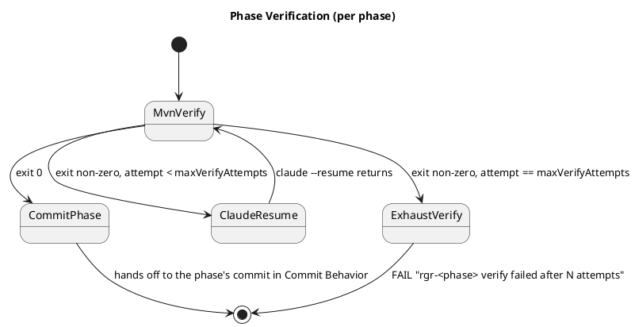

`MvnVerify` tees its stdout to `${baseDir}/log.txt` (issue 325) — the file is overwritten on every invocation, so on retry the latest verify failure replaces the previous one. The intent is for the next `claude --resume` to surface the most recent failure detail; same file Red Phase uses, since both red and verify failures feed the same downstream prompt.

Files under this sub-machine:

- `Phase Verification.asciidoc` — all verify transitions, both phases.
- `Mvn Output Log Verify.asciidoc` — `MvnVerify` writes mvn clean verify output to `${baseDir}/log.txt`, exercised in both Green and Refactor by pushing each phase's verify into the exhaustion path so the assertion fires after a deterministic abort.

Counting rule: on exhaustion, `mvn clean verify` was invoked `maxVerifyAttempts` times and `claude --resume` exactly `maxVerifyAttempts - 1` times.

Resume call (issue #311): `claude --resume <session-id> "mvn clean verify failures should be fixed"`, where `<session-id>` is the UUID captured on this phase's initial call in `Claude Retry Loop`.

---

## Refactor Session Mode

Refactor-only sub-machine. Decides whether the refactor `ClaudeRunner` starts a fresh Claude session (separate UUID from green — legacy shape) or continues the green session (reuse green's UUID, scoping refactor's review to the files green just touched — current default). Gated by the `refactorSessionMode` maven parameter (issue #287). The default flipped to `continue` in pass 2 of the same issue; the legacy `fresh` shape stays in the code as a redundant knob but no test spec sets it.

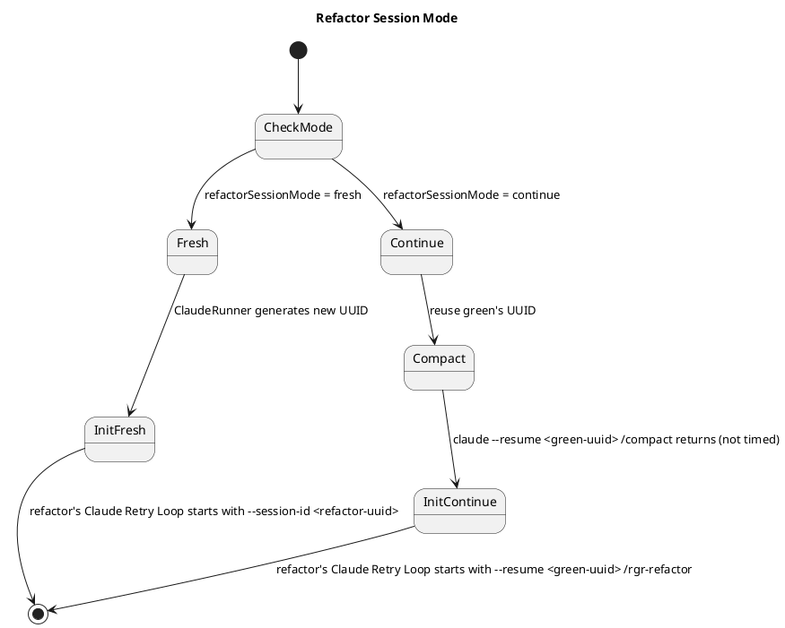

Notes:

- `Continue` (the default) adds exactly one extra `claude --resume <green-uuid> /compact` line to `darmok.runners.<date>.log` immediately before refactor's first `/rgr-refactor` call. The compact call carries green's UUID, not a fresh refactor UUID. Refactor's first timed claude invocation is `claude --resume <green-uuid> --print --dangerously-skip-permissions --model opus /rgr-refactor <pipeline> code-prj` — there is no `--session-id` flag and no separate refactor UUID, because the runner is reusing green's session.
- The `/compact` call is **not timed** — `phase_refactor_ms` starts after compact returns (the call is issued from `RefactorPhase.prepareSession`, which `DarmokMojo.processScenario` invokes before `refactorPhase.run(state)`). Compact runtime is logged in the runner log (DEBUG line) but excluded from the metrics row.
- Every downstream refactor sub-machine (Phase Timeout, Directory Allowlist, Phase Verification) reuses green's UUID for its `--resume` calls in `Continue` mode, since the refactor `ClaudeRunner` captured green's UUID rather than generating its own.
- `Fresh` is observable-empty: the legacy shape (separate refactor UUID, no `/compact` preamble) is still reachable via `refactorSessionMode=fresh` but no test spec sets it; the parameter remains as a redundant knob.

Files under this sub-machine:

- `Refactor Session Mode.asciidoc` — `Continue` transitions (initial call uses green's UUID after `/compact`; downstream resume reuses green's UUID).

---

## Commit Behavior

`commitIfChanged` runs `git diff --cached --quiet` before every commit; an empty stage produces no commit. The commit messages and counts depend on `stage` and on which phases executed.

`removeFirstScenarioFromFile()` runs **after** the refactor-phase Directory Allowlist check (issue #314). The scenarios-list.txt delta lands in whichever commit closes the scenario — refactor's commit under `stage=false`, or the post-`--amend` red commit under `stage=true`. Neither phase's allowlist `git status --porcelain` ever sees scenarios-list.txt as a changed path. The red-exit-100 path keeps its inline `removeFirstScenarioFromFile()` call (no green/refactor phase runs, so there is no allowlist gate to defer behind).

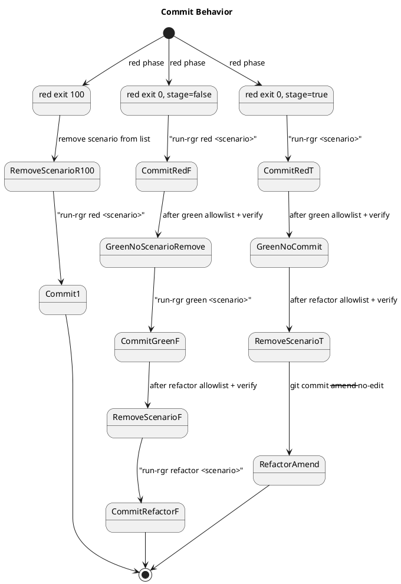

Files under this sub-machine:

- `Commit Behavior Clean Workspace.asciidoc` — `commitIfChanged` skip-on-empty-stage.
- `Commit Behavior Full Cycle.asciidoc` — per-phase vs combined commits (`stage` flag), including the GH314 Test-Case that pins down scenarios-list mod happening after both phases' allowlist checks (refactor allowlist's `git status --porcelain` does not list scenarios-list.txt).
- `Commit Behavior Process Charts.asciidoc` — `metrics.csv` commit-SHA column on every row.
- `Metrics Csv Timestamps.asciidoc` — `metrics.csv` timestamp column ISO-8601-with-offset format (issue 316).
- `Metrics Csv Special Characters.asciidoc` — `DarmokMojoMetrics` `escape` + `parse` + `splitCsv` round-trip (issue 302): scenario names containing `,` and `"`, plus pre-populated metrics.csv fixtures that exercise the parser's blank-middle-line and short-row branches that real Darmok runs never produce. Residual: `escape` newline branch (scenarioName never carries `\n` because parseScenarios reads it line-by-line); `parse` null/missing-file branches and `column`/`findNext` no-match branches (asserting on null via the table-driven assertion path requires either a TestState extension or a new step phrase, deferred).

Phase-failure implications:

- Red pass + green fail — impossible (red pass short-circuits to commit).
- Red fail + green fail (non-retryable/exhausted/timeout/verify/allowlist) — red commit stands in both modes (red always commits now).
- Red fail + green OK + refactor fail — under `stage=false` green's commit stands; under `stage=true` red's commit stands (not amended, since refactor never reached its commit step).

`metrics.csv` row contract (one row per successful scenario, appended atomically):

| Column | Source | Notes |
|---|---|---|
| `Timestamp` | `init()` wallclock per scenario | Timezone-aware ISO-8601 with numeric offset (`yyyy-MM-dd'T'HH:mm:ss.SSSXXX`) so Grafana resolves the instant without guessing a zone. Issue 316. |
| `GitBranch` | `gitBranch` parameter | Validated at init against `git rev-parse --abbrev-ref HEAD`. Stable across all rows of a run. |
| `Commit` | `git rev-parse HEAD` after `RefactorAmend` / `CommitRefactorF` / `Commit1` | 40-char SHA of whichever commit this scenario produced last. Under `stage=true` the SHA is red's post-amend SHA (refactor's `--amend` rewrites it). |
| `Scenario` | scenario name from `scenarios-list.txt` | |
| `PhaseRedMs` | millis elapsed in `Red Phase` | |
| `PhaseGreenMs` | millis elapsed in `Claude Retry Loop` + `Phase Timeout` + `Phase Verification` for green | 0 when red exit 100 |
| `PhaseRefactorMs` | same three sub-machines, refactor side | 0 when red exit 100 |
| `PhaseTotalMs` | scenario wall-clock | |

---

## Gen From Comparison

Wraps the standard scenario iteration with one claude call per loop.

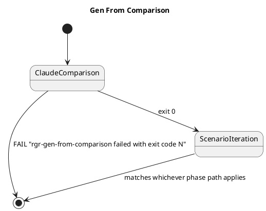

Files under this sub-machine:

- `Gen From Comparison.asciidoc` — skill-success (full cycle below follows) and skill-fail (abort before any `Processing Scenario:` line).

---

## Input dimensions

Parameters that change observable behavior:

| Dimension | Values |
|---|---|
| `gitBranch` param | unset · matches HEAD · mismatches HEAD · detached HEAD |
| `baselineVerifyEnabled` param | `true` (default — sub-machine runs) · `false` (sub-machine skipped) · baseline exit 0 · baseline exit non-zero |
| `scenariosFile` state | absent · empty · N entries |
| `scenario.tag` | `NoTag` · regular |
| asciidoc file state | missing · target tag present · other tags present · no tag line |
| red outcome | exit 100 · exit 0 |
| green outcome | success · non-retryable fail · retryable-recover · retryable-exhaust |
| refactor outcome | success · fail (mirrors green axes) |
| `stage` | `true` (combined commit) · `false` (per-phase commits) |
| `refactorSessionMode` | `continue` (default — reuse green's UUID after un-timed `/compact`) · `fresh` (refactor generates its own UUID, legacy shape, no test spec sets it) |
| `pipeline` | `forward` · `reverse` (refactor prompt only) |
| `onlyChanges` | `false` (default) · `true` (svc-plugin goals only) |
| `LOG_PATH` env | unset (`target/darmok/`) · set |
| `maxClaudeSeconds` | 720 (UCL default) · small N (test-compressed) |
| `maxTimeoutAttempts` | 2 (default) · N |
| `maxAllowlistAttempts` | 2 (default) · N |
| `allowlistBasePaths` | `src/main/java/,src/test/java/org/farhan/impl/` (default) · narrowed (tightening) |
| `allowlistAdditionalPaths` | empty (default) · CSV of extra paths (the common knob, e.g. `src/test/resources/mojo-defaults.properties`) |
| `maxVerifyAttempts` | 3 (default) · N |
| `maxRetries` | default · N |
| per-attempt claude runtime | ≤ timeout · > timeout → kill |
| post-kill install outcome | exit 0 · exit non-zero |
| allowlist outcome | pass-first-try · recover-after-revert-and-resume · exhaust |

---

## Observations

1. **Branch Verification, Init and Cleanup are invariants** — every run passes through them. Could become a shared `Test-Setup`.
2. **Tag Insertion and the phase sub-machines are orthogonal.** Full matrix would be 4 × 7 = 28; current shape is 4 tag specs × 1 default phase + 7 phase specs × 1 default tag = 11. The cross-product isn't worth the maintenance.
3. **`commitIfChanged` skip-on-empty-stage** (`git diff --cached --quiet`) is covered by `Commit Behavior Clean Workspace`.
4. **`pipeline` parameter** (`forward` / `reverse`) only changes the refactor prompt string; observable diff is limited to the `claude` runner log line.
5. **Metrics** — every successful scenario emits four `METRIC` log lines plus a `metrics.csv` row. Consumed by `pbc-report-plantuml`, so the format is part of the contract. See **Commit Behavior** for the row shape.
6. **`LOG_PATH` env var** — if set, logs land elsewhere. One spec covering "LOG_PATH set" is enough.
7. **No refactor-only path** — tree shape is `Red → (Green → Refactor)` or `Red alone`.
8. **Phase Verification is a sub-step, not a phase** — it lives inside green and inside refactor, after the Claude Retry Loop, Phase Timeout, and Directory Allowlist sub-machines have reached exit 0.
9. **Phase Timeout and Directory Allowlist are also sub-steps** — order within each phase is: Claude Retry Loop → Phase Timeout (only fires if the claude call exceeded `maxClaudeSeconds`) → Directory Allowlist → Phase Verification → phase commit. Allowlist exhaustion aborts the phase without a commit, same as a verify exhaustion. Timeouts are not API errors and don't consume `maxRetries`; allowlist violations don't consume `maxRetries` or `maxVerifyAttempts` either.
10. **`maxClaudeSeconds` source** — default 720 comes from the UCL of the per-scenario runtime distribution on the SPC dashboard. When grafana becomes queryable from the plugin (future issue), this property becomes the fallback for "grafana unavailable", not the default value.
11. **`${baseDir}/log.txt` is the per-iteration mvn output handoff** (issue 325) — written by Red Phase's `mvn test` and by Phase Verification's `mvn clean verify` (in both Green and Refactor). Overwritten, not appended. Lives at the project root (not under `target/`, because `mvn clean verify` would wipe it). Distinct from the dated `darmok.runners.<date>.log`, which captures every subprocess invocation as wrapped DEBUG entries — log.txt is the raw mvn output the next claude prompt reads.

---

## Notes

- Regenerate when `DarmokMojo` or its helpers gain a new branch point. The file is the model; the code is the ground truth.
